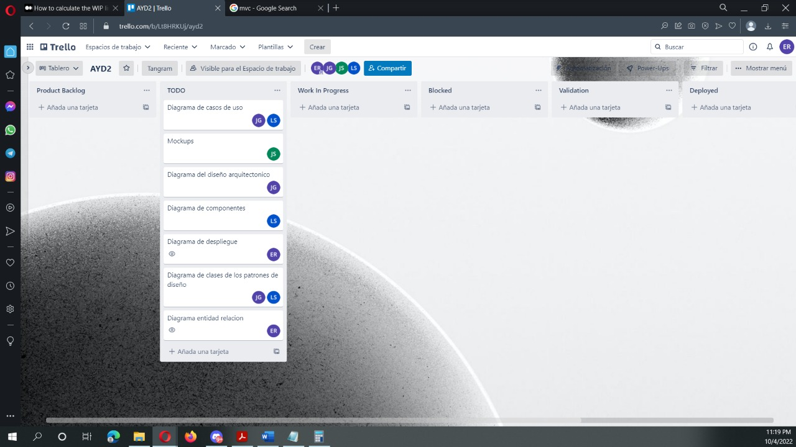
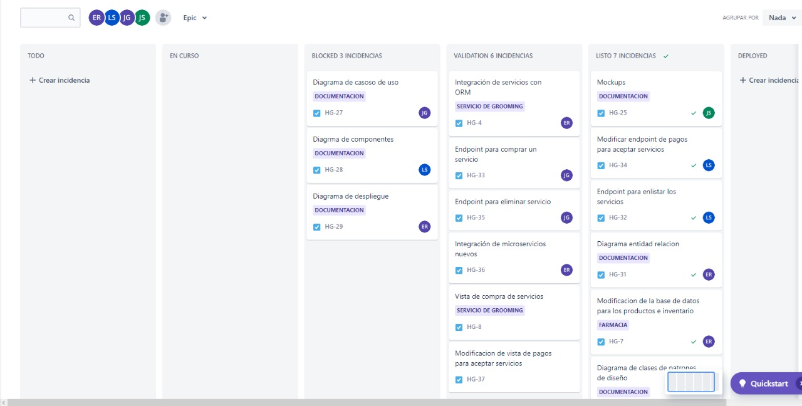

# Sprint 5

### 04/10/2022 - 12/10/2022

## Sprint Backlog
| Tarea | Terminado | Justificacion |
|-------|-----------|---------------|
| Diagrama de Despliegue | | Debido a que no se ha definido la arquitectura, no se ha podido actualizar el diagrama. |
| Diagrama entidad relacion | X | |
| Modificar endpoint de pagos para aceptar servicios| X | |
| Endpoint para enlistar los servicios| X | |
| Vista de administrador para manejar productos | X | |
| Vista de administrador para manejar servicios | X | |

## Tablero Previo al Sprint


## Tablero Posterior al Sprint


## Sprint Retrospective
### Erick Villatoro
__¿Qué hizo bien durante el Sprint?__
Creo que se tomó una decisión acertada al dedicar una parte del proyecto a informarse bien y documentar el trabajo que se hará. Esto permite que tengamos una visión general de lo que estamos haciendo. 

__¿Qué hizo mal durante el Sprint?__
No se tuvo comunicación con un compañero y aun así se le asignaron tareas. Además, alguna documentación se debió hacer cuando ya se haya implementado. 

__¿Qué mejoras se deben implementar para el próximo sprint?__
Se debe tener una mejor comunicación con los compañeros de trabajo e intentar entregar valor en cada sprint, no tanta documentación. 

### Luis Diego de Leon Sanchez
__¿Qué hizo bien durante el Sprint?__
Se desarrollaron las funcionalidades establecidas para dicho momento las cuales sirvieron para mantener el flujo apropiado del proyecto sin retrasos.

__¿Qué hizo mal durante el Sprint?__
La comunicacion no fue acertiva, por lo que se encontraron malentendidos a la hora de unir el backend y frontend por lo que genero un poco de confusion.

__¿Qué mejoras se deben implementar para el próximo sprint?__
Establecer tareas equitativas y claras para cada uno de los integrantes para asi mejorar la manera de trabajo y no perder el tiempo esperando a que cada uno culmine su trabajo.

### Josué David Zea Herrera
__¿Qué hizo bien durante el Sprint?__
Se logró implementar de manera exitosa las funcionalidades iniciales, mismas que darían paso a completar los requerimientos solicitados.

__¿Qué hizo mal durante el Sprint?__
La comunicación fue un impedimento al momento de querer unificar frontend y backend ya que no había una guia de como debíamos realizar la correcta comunicación entre ambos.


__¿Qué mejoras se deben implementar para el próximo sprint?__
Establecer tareas más equitativas para que el aporte de cada integrante sea funcional y capaz de acoplarse a los demás requerimientos.

### Juan Diego Alvarado 
__¿Qué hizo bien durante el Sprint?__
Set empezo a trabajar la segunda fase de manera correcta y eficaz

__¿Qué hizo mal durante el Sprint?__
La asignación de tareas

__¿Qué mejoras se deben implementar para el próximo sprint?__
Se debe mejorar la comunicación dentro del equipo  y saber organizar mejor el tiempo de cada uno
## Cálculo de WIP
```
VA: Work in progress, validacion, deployed
NVA Blocked, TODO

Promedio: 
VA: 3H = 9H
NVA: 1 días = 5h

Eficiencia = 0.64

Numero de tareas = 13 


Work in progress = 3/9 = 33% = 4 tareas
validacion,  = 3/9 = 33% = 4 tareas
deployed = 3/9 = 33% = 4 tareas
```

## Resumen Actividades

| Historia | Persona | Rama | Link de Rama | 
|----------|---------|------|--------------|
| Diagrama entidad relacion | Erick Villatoro | feature/HG-31-diagrama-entidad-relacion | [Link](https://gitlab.com/javillatoro1/ayd2_proyecto1/-/tree/feature/HG-31-diagrama-entidad-relacion) |
| Modificar endpoint de pagos para aceptar servicios | Diego Sanchez | feature/HG-34-Modifica-endpint-de-servicios | [Link](https://gitlab.com/javillatoro1/ayd2_proyecto1/-/tree/feature/HG-34-Modifica-endpint-de-servicios) |
| Vista del administrador para manejar productos | Josué Zea | feature/HG-38-vista-para-operaciones-con-productos-por-el-administrador | [Link](https://gitlab.com/javillatoro1/ayd2_proyecto1/-/tree/feature/HG-38-vista-para-operaciones-con-productos-por-el-administrador)|
|Vista de administrador para manejar servicios | Juan Diego Alvarado | feature/HG-46-Vista de administrador para manejar servicios | [Link](https://gitlab.com/javillatoro1/ayd2_proyecto1/-/tree/feature/HG-46Vistadeadministradorparamanejarservicios) |