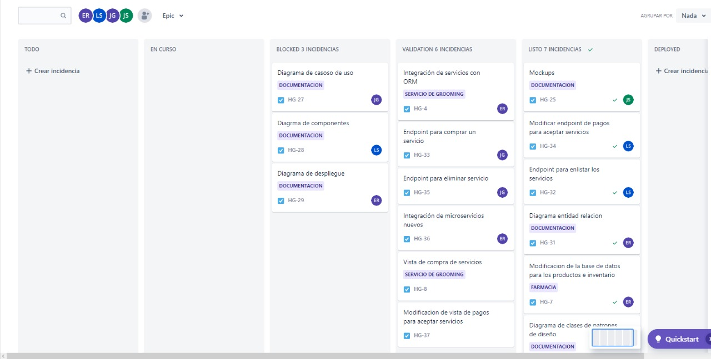

# Sprint 6

### 12/10/2022 - 14/10/2022

## Sprint Backlog
| Tarea | Terminado | Justificacion |
|-------|-----------|---------------|
| Integración de servicios con ORM | X | |
| Integración de microservicios nuevos| X | |
| WS para obtener todos los productos | X | |
| WS para agregar un producto | X | |
| WS para modificar el precio de un producto | X | |
| Diagrama de clases de patrones de diseño | X | |
| Manejo de edición y agregar productos del adminstrador | X | |
| Vista del administrador para manejar las promociones | X | |

## Tablero Previo al Sprint


## Tablero Posterior al Sprint


## Sprint Retrospective
### Erick Villatoro
__¿Qué hizo bien durante el Sprint?__
Se empezó a implementar las diferentes funcionalidades, por lo que se tuvieron avances importantes. 

__¿Qué hizo mal durante el Sprint?__
Se siguió tomando en cuenta a un integrante de grupo que con el que no se tenía comunicación, por lo que, se debieron reasignar las tareas a otro integrante. 

__¿Qué mejoras se deben implementar para el próximo sprint?__
Se debe planificar las tareas de manera que no se bloqueen las unas a las otras. Además, de dejar de tomar en cuenta al integrante faltante. 

### Diego Sanchez
__¿Qué hizo bien durante el Sprint?__
Se realizaron correctamente los WS estipulados para el momento del sprint

__¿Qué hizo mal durante el Sprint?__
Se encontro un retraso en la elaboracion del proyecto dado a la reestructuracion que el equipo tubo que tener

__¿Qué mejoras se deben implementar para el próximo sprint?__
Mejorar la agilidad de trabajo para mantener un ritmo constante y no generar mas retrasos

### Josué David Zea Herrera
__¿Qué hizo bien durante el Sprint?__
Se avanzó con las funcionalidades específicas para este sprint, logrando los avances necesarios para cumplir con la funcionalidad.

__¿Qué hizo mal durante el Sprint?__
Se tuvo inconvenientes con la restructuración de la participación y la necesidad de ponerse al corriente del código por mi parte.


__¿Qué mejoras se deben implementar para el próximo sprint?__
Se debe considerar que el trabajo de uno no debe impedir el progreso de los demás, tratar la manera de que el trabajo sea fluido y no dependa de los demás.

### Juan Diego Alvarado 
__¿Qué hizo bien durante el Sprint?__
Se mejoro la comunicación en el equipo  y se asignarón mejor las tareas 

__¿Qué hizo mal durante el Sprint?__
La planificación por tiempo  por cada tarea 

__¿Qué mejoras se deben implementar para el próximo sprint?__
Se debe seguir trabajando en la comunicación del equipo
## Cálculo de WIP
```
VA: Work in progress, validacion, deployed
NVA Blocked, TODO

Promedio: 
VA: 3H = 9H
NVA: 1 días = 5h

Eficiencia = 0.64

Numero de tareas = 13 


Work in progress = 3/9 = 33% = 4 tareas
validacion,  = 3/9 = 33% = 4 tareas
deployed = 3/9 = 33% = 4 tareas
```

## Resumen Actividades

| Historia | Persona | Rama | Link de Rama | 
|----------|---------|------|--------------|
| Integración de servicios con ORM | Erick Villatoro | feature/feature/HG-4-integracion-de-servicios-con-orm | [Link](https://gitlab.com/javillatoro1/ayd2_proyecto1/-/tree/feature/feature/HG-4-integracion-de-servicios-con-orm)|
| Integración de microservicios nuevos| Erick Villatoro | feature/HG-36-integración-de-microservicios-nuevos | [Link](https://gitlab.com/javillatoro1/ayd2_proyecto1/-/tree/feature/HG-36-integración-de-microservicios-nuevos)|
|WS para obtener todos los productos|Diego Sanchez|feature/HG-13-WS-para-obtener-todos-los-productos|[Link](https://gitlab.com/javillatoro1/ayd2_proyecto1/-/tree/feature/HG-13-WS-para-obtener-todos-los-productos)|
|WS para agregar un producto|Diego Sanchez|feature/HG-14-WS-para-agregar-un-producto|[Link](https://gitlab.com/javillatoro1/ayd2_proyecto1/-/tree/feature/HG-14-WS-para-agregar-un-producto)|
|WS para modificar el precio de un producto|Diego Sanchez|feature/HG-15-WS-para-modificar-el-precio-de-un-producto|[Link](https://gitlab.com/javillatoro1/ayd2_proyecto1/-/tree/feature/HG-15-WS-para-modificar-el-precio-de-un-producto)|
|Diagrama de clases de patrones de diseño|Diego Sanchez|feature/HG-30-Diagrama-de-clases-de-patrones-de-diseno|[Link](https://gitlab.com/javillatoro1/ayd2_proyecto1/-/tree/feature/HG-30-Diagrama-de-clases-de-patrones-de-diseno)|
| Manejo de edición y agregar productos del adminstrador | Josué Zea | feature/HG-38-vista-para-operaciones-con-productos-por-el-administrador | [Link](https://gitlab.com/javillatoro1/ayd2_proyecto1/-/tree/feature/HG-38-vista-para-operaciones-con-productos-por-el-administrador)|
|Vista del administrador para manejar las promociones|Juan Diego Alvarado Salguero|feature/HG-47 Vista del administrador para manejar las promociones|[Link](https://gitlab.com/javillatoro1/ayd2_proyecto1/-/tree/feature/HG47-Vistadeladministradorparamanejarlaspromociones)|