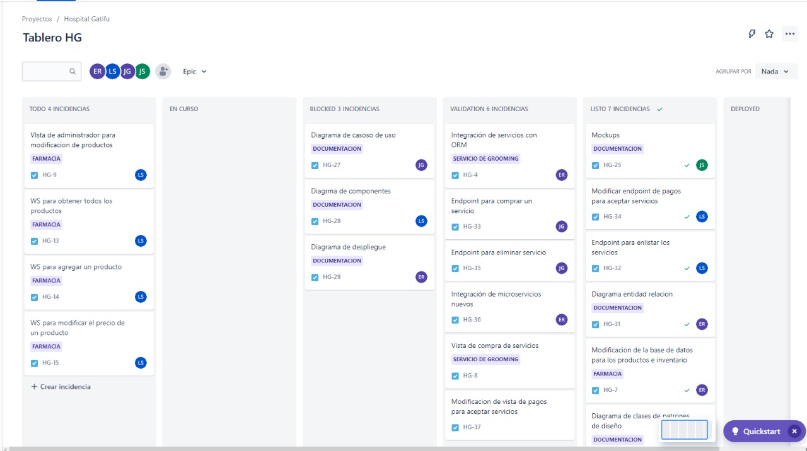
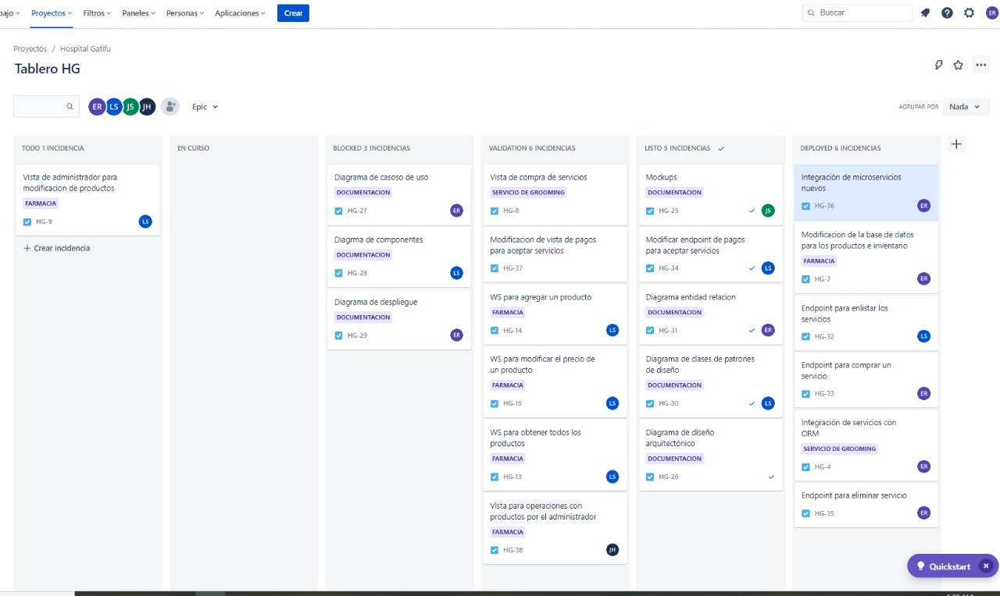

# Sprint 7

### 14/10/2022 - 15/10/2022

## Sprint Backlog
| Tarea | Terminado | Justificacion |
|-------|-----------|---------------|
| Integración de microservicios nuevos | X | |
| Endpoint para comprar un servicio | X | |
| Endpoint para eliminar servicio | X | |
| Crear webservicio para contratación de paquete | X | |
| Diagrama de componentes | X | |
| Creación de las vistas, de servicios y promociones del lado del cliente   | X | |
| Creación de la vista especializada en productos del lado del cliente | X | |

## Tablero Previo al Sprint


## Tablero Posterior al Sprint


## Sprint Retrospective
### Erick Villatoro
__¿Qué hizo bien durante el Sprint?__
Se asignaron las tareas correctamente y se lograron desplegar correctamente los diferentes servicios.

__¿Qué hizo mal durante el Sprint?__
Se utilizaron las imágenes de node incorrectas, por lo que eran muy pesadas. Además, algunas tareas necesitaban otras como prerequisito y causaban bloqueos. 
__¿Qué mejoras se deben implementar para el próximo sprint?__
Se deben cambiar las imágenes de node para utilizar unas más ligeras. Se deben fijar las prioridades para evitar los bloqueos. 

### Diego Sanchez
__¿Qué hizo bien durante el Sprint?__
Se actualizo documentacion sobre diagrama de componentes adecuado con la arquitectura actual que posee el sistema

__¿Qué hizo mal durante el Sprint?__
Se mantuvo poca comunicacion durante el sprint

__¿Qué mejoras se deben implementar para el próximo sprint?__
Avanzar en equipo a la hora de implementar nuevas funcionalidades

### Josué Zea
__¿Qué hizo bien durante el Sprint?__
Se implementó correctamente funcionalidades específicas y se actualizó documentación necesaria.


__¿Qué hizo mal durante el Sprint?__
La comunicación y documentación para el código hizo que unificar algunas cosas fuera complicado.


__¿Qué mejoras se deben implementar para el próximo sprint?__
Documentar mejor como espero enviar y recibir la información necesaria para el correcto funcionamiento de la aplicación.

### Juan Diego Alvarado 
__¿Qué hizo bien durante el Sprint?__

La comunicación dentro del equipo sigue mejorando
__¿Qué hizo mal durante el Sprint?__
La planificación de las tareas no se realizo como se debia

__¿Qué mejoras se deben implementar para el próximo sprint?__
Se tiene que seguir mejorando , la comunicación dentro del equipo 

## Cálculo de WIP
```
VA: Work in progress, validacion, deployed
NVA Blocked, TODO

Promedio: 
VA: 3H = 9H
NVA: 1 días = 5h

Eficiencia = 0.64

Numero de tareas = 13 


Work in progress = 3/9 = 33% = 4 tareas
validacion,  = 3/9 = 33% = 4 tareas
deployed = 3/9 = 33% = 4 tareas
```

## Resumen Actividades

| Historia | Persona | Rama | Link de Rama | 
|----------|---------|------|--------------|
| Endpoint para comprar un servicio | Erick Villatoro | feature/HG-33-endpoint-para-comprar-un-servicio | [Link](https://gitlab.com/javillatoro1/ayd2_proyecto1/-/tree/feature/HG-33-endpoint-para-comprar-un-servicio)|
| Endpoint para eliminar servicio | Erick Villatoro | feature/HG-35-endpoint-para-eliminar-servicio | [Link](https://gitlab.com/javillatoro1/ayd2_proyecto1/-/tree/feature/HG-35-endpoint-para-eliminar-servicio)|
| Crear webservicio para contratación de paquete | Erick Villatoro | feature/HG-6-crear-webservicio-para-contratación-de-paquete | [Link](https://gitlab.com/javillatoro1/ayd2_proyecto1/-/tree/feature/HG-6-crear-webservicio-para-contratación-de-paquete)|
| Diagrama de componentes | Diego Sanchez |feature/HG-28-Diagrama-de-componentes|[Link](https://gitlab.com/javillatoro1/ayd2_proyecto1/-/tree/feature/HG-28-Diagrama-de-componentes) |
| Creación de la vista especializada en productos del lado del cliente | Josué Zea | /feature/HG-41-vista-de-cliente-para-comprar-productos | [Link](https://gitlab.com/javillatoro1/ayd2_proyecto1/-/tree/feature/HG-41-vista-de-cliente-para-comprar-productos)|
| Creación de las vistas, de servicios y promociones del lado del cliente | Juan Diego Alvarado  |feature/HG-48-Creación de las vistas, de servicios y promociones del lado del cliente|[Link](https://gitlab.com/javillatoro1/ayd2_proyecto1/-/tree/feature/HG-48Creacióndelasvistas,deserviciosypromocionesdelladodelcliente) |

