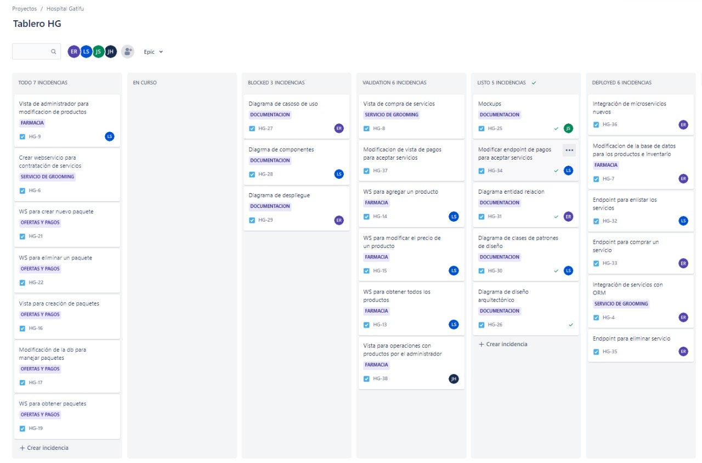
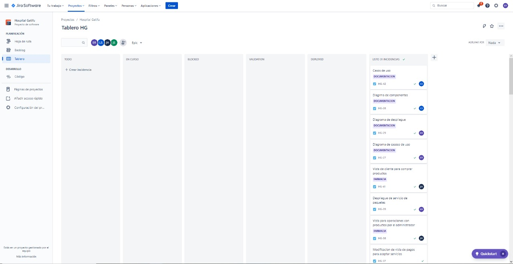

# Sprint 8

### 15/10/2022 - 16/10/2022

## Sprint Backlog
| Tarea | Terminado | Justificacion |
|-------|-----------|---------------|
| Casos de uso |X||
| WS para crear nuevo paquete | X | |
| WS para eliminar un paquete | X | |
| Despliegue de servicio de paquetes | X | |
| Pago por productos | X | |
| Actualizacion de imagenes de node | X | |
| Mockups | X | |
| Unificación de pago por productos de frontend a backend | X | |
| Unificacion de documentacion| X | |

## Tablero Previo al Sprint


## Tablero Posterior al Sprint


## Sprint Retrospective
### Erick Villatoro
__¿Qué hizo bien durante el Sprint?__
Se realizaron la mayor parte de tareas que estaban bloqueadas, además, se lograron integrar los diferentes servicios del backend con el frontend. 

__¿Qué hizo mal durante el Sprint?__
Como se retrasó toda la codificación del backend, el frontend tuvo que aplazar algunas tareas.

__¿Qué mejoras se deben implementar para el próximo sprint?__
Se deben definir de manera correcta las tareas que son útiles para otras tareas. Y con respecto a ello, definir las prioridades, dependencias y asignaciones. 

### Diego Sanchez
__¿Qué hizo bien durante el Sprint?__
Se terminaron los casos de uso respecto a las funcionalidades faltantes explicando como es su utilizacion en el sistema

__¿Qué hizo mal durante el Sprint?__
Se aplazaron muchas tareas debido al tiempo y a la ausencia de un integrante

__¿Qué mejoras se deben implementar para el próximo sprint?__
Planificar de mejor manera el tiempo y el trabajo para que todo marche de acuerdo al ritmo deseado

### Josué Zea
__¿Qué hizo bien durante el Sprint?__
Se logró realizar una comunicación efectiva del frontend y backend, de manera que todos los requerimientos finales fueron cumplidos de manera satisfactoria.


__¿Qué hizo mal durante el Sprint?__
Debido a que se vio retrasado la implementación del baquend en algunas tareas, fue necesario trabajar sin poder realizar pruebas finales con la información real.


__¿Qué mejoras se deben implementar para el próximo sprint?__
Tratar la manera de definir correctamente las tareas que tienen mayor relevancia, tamibén un poco más de documentación del código para facilitar la unión.


### Juan Diego Alvarado 
__¿Qué hizo bien durante el Sprint?__
Se concluyo  todas las tareas de desarrollo de la fase

__¿Qué hizo mal durante el Sprint?__
Especificar mejor lo que se requiere en cada tarea

__¿Qué mejoras se deben implementar para el próximo sprint?__
Que la comunicación siga fluyendo para poder seguir trabajando correctamente en las siguientes fases 
## Cálculo de WIP
```
VA: Work in progress, validacion, deployed
NVA Blocked, TODO

Promedio: 
VA: 3H = 9H
NVA: 1 días = 5h

Eficiencia = 0.64

Numero de tareas = 13 


Work in progress = 3/9 = 33% = 4 tareas
validacion,  = 3/9 = 33% = 4 tareas
deployed = 3/9 = 33% = 4 tareas
```

## Resumen Actividades

| Historia | Persona | Rama | Link de Rama | 
|----------|---------|------|--------------|
|Unificacion de documentacion|Erick Villatoro| feature/HG-49-unificacion-de-documentacion | [Link](https://gitlab.com/javillatoro1/ayd2_proyecto1/-/tree/feature/HG-49-unificacion-de-documentacion)|
| WS para crear nuevo paquete | Erick Villatoro | feature/HG-21-ws-para-crear-nuevo-paquete | [Link](https://gitlab.com/javillatoro1/ayd2_proyecto1/-/tree/feature/HG-21-ws-para-crear-nuevo-paquete)|
| WS para eliminar un paquete | Erick Villatoro | feature/HG-22-ws-para-eliminar-un-paquete | [Link](https://gitlab.com/javillatoro1/ayd2_proyecto1/-/tree/feature/HG-22-ws-para-eliminar-un-paquete)|
| Despliegue de servicio de paquetes | Erick Villatoro | feature/HG-39-despliegue-de-servicio-de-paquetes | [Link](https://gitlab.com/javillatoro1/ayd2_proyecto1/-/tree/feature/HG-39-despliegue-de-servicio-de-paquetes)|
| Pago por productos | Erick Villatoro | feature/HG-40-pago-por-productos | [Link](https://gitlab.com/javillatoro1/ayd2_proyecto1/-/tree/feature/HG-40-pago-por-productos)|
| Actualizacion de imagenes de node | Erick Villatoro | feature/HG-43-actualizacion-de-imagenes-de-node | [Link](https://gitlab.com/javillatoro1/ayd2_proyecto1/-/tree/feature/HG-43-actualizacion-de-imagenes-de-node)|
| Casos de uso | Diego Sanchez | feature/HG-42-Casos-de-uso | [Link](https://gitlab.com/javillatoro1/ayd2_proyecto1/-/tree/feature/HG-42-Casos-de-uso) |
| Unificación de pago por productos de frontend a backend | Josué Zea | /feature/HG-41-vista-de-cliente-para-comprar-productos | [Link](https://gitlab.com/javillatoro1/ayd2_proyecto1/-/tree/feature/HG-41-vista-de-cliente-para-comprar-productos)|
| Mockups | Juan Diego Alvarado | feature/HG-25-Mockups | [Link](https://gitlab.com/javillatoro1/ayd2_proyecto1/-/tree/feature/HG-25-Mockups) |

