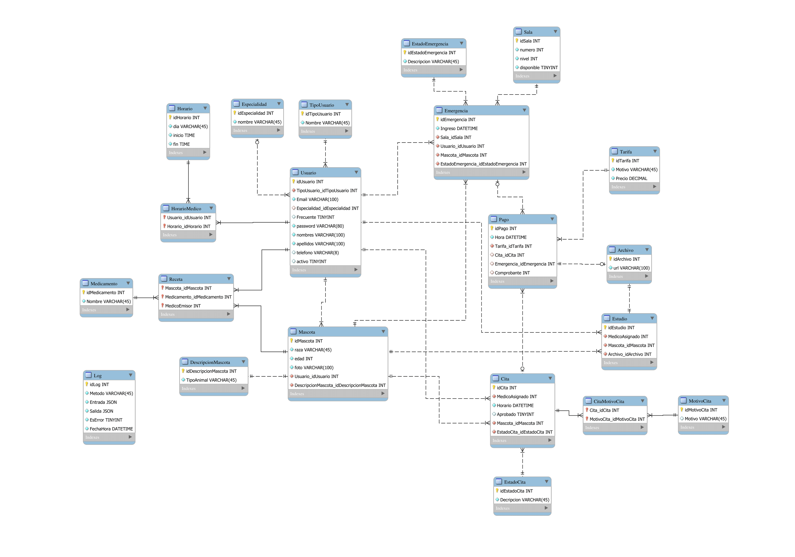

# Hospital Gatifu

## Desarrolladores

| Nombre                                 | Carné    |
| ---------------------------------------- | ----------- |
| Erick José André Villatoro Revolorio | 201900907 |
| José Ottoniel Sincal Guitzol          | 201801375 |
| Luis Diego de Leon Sanchez             | 201800987 |
| Juan Diego Alvarado                    | 201807335 |

## Mockups

## Diagrama de diseño arquitectónico

## Diagrama de casos de uso

* Secretaria
  
* Administrador
  
* Cliente
  
* Medico
  
* Pagos
  
* Grooming
  
* Productos
  

## Diagrama de clases Patron de diseño - Decorator (Modificar servicio)

## Diagrama de clases Patron de diseño - MVC (Enlistar servicio)

## Diagrama de clases Patron de diseño - Singleton (Comprar Servicio)

## Diagrama de clases Patron de diseño - Proxy (Eliminar Servicio)

## Diagrama de Componentes

## Diagrama de Despliegue

## Base de Datos

### Modelo Entidad Relación

### Stored Procedures

A continuación de encuentra la [documentación](./BDD/README.md) de todos los stored procedures que se realizaron.
